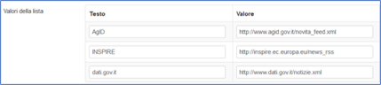
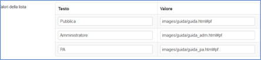
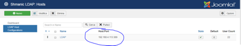

# Manuale di installazione e configurazione

Il repository contiene i seguenti file e cartelle:

- [```geoportale```](../geoportale)
  - [```/includes```](../geoportale/includes)
    Contiene file .php. &quot;geoportale&quot; è il nome dell&#39;applicazione Joomla, che può essere comunque modificato
  - [```/templates/rndt```](../geoportale/templates/rndt)
    Template Joomla completo dell&#39;applicazione.
  - [```/images/guida```](../geoportale/images/guida)
    Contiene i file html della guida in linea.
  - [```/language/overrides```](../geoportale/language/overrides)
    Contiene i file degli override delle lingue Italiano e Inglese.
  - [```/RNDT-JoomlaDB```](../geoportale/RNDT-JoomlaDB)
    Contiene il dump del DB Joomla utile per ricreare i contenuti del portale.
- [```documentation```](../documentation)
    Manuale di installazione e configurazione.
    
I prerequisiti minimi per eseguire il software sono i seguenti:

- Sistema operativo (Linux o Windows)
- Apache Web server (2.4.6) (o IIS 7 o 8) installato e attivo
- PHP 7.1 installato e configurato inclusa estensione per mysql, mbstring e ldap
- Joomla 3.8 con estensione Shmanic LDAP.

## Installazione

L&#39;installazione del Geoportale consiste nelle seguente operazioni:

- copiare ```geoportale/includes/*.php``` nella propria installazione ```<webserver>/geoportale/includes```
- copiare [```geoportale/templates/rndt```](../geoportale/templates/rndt) nella propria installazione ```<webserver>/geoportale/templates```
- copiare [```geoportale/images/guida```](../geoportale/images/guida) nella propria installazione ```<webserver>/geoportale/images/guida```
- copiare [```geoportale/language/overrides```](../geoportale/language/overrides) nella propria installazione ```<webserver>/geoportale/language/overrides```..

## Configurazione

La configurazione di Joomla si effettua o dall&#39;ambiente amministrativo oppure modificando il file ```<webserver>/geoportale/configuration.php```. Vi sono inoltre alcune configurazioni aggiuntive quali LDAP, le News e la guida.

### Configurazione globale (db, mail etc.)

I parametri del file ```configuration.php``` da verificare/modificare sono:

**Connessione con il GPT:**

**Nuovi parametri per questa versione:**

|  |  |
| --- | --- |
| public $auth_server_ldap=&quot;\*\*\*\*\*\*&quot; | Valore di sincronizzazione per le chiamate al catalogo. Deve essere uguale al valore del parametro userNoAuth nel file gpt.xml (vedi configurazione webapps) |
| public $auth\_id = &#39;\*\*\*\*\*\*\*&#39; | Id di autenticazione ai servizi IPA per la ricerca dei nomi ufficiali degli enti della PA |
| public $url\_WS05 = &#39;https://www.indicepa.gov.it/public-ws/WS05\_AMM.php &#39; | URL del servizio di ricerca su IPA (vedi documentazione IPA) |
| public $url\_WS16 = &#39;https://www.indicepa.gov.it/public-ws/WS16\_DES\_AMM.php &#39; | URL del servizio di ricerca su IPA (vedi documentazione IPA) |
| public $GeoDCATAP\_IT = &#39;https://geodati.gov.it/geodcat-ap_it/index.php?outputTranformation=geodcatap_it&amp;inputFormat=REST&amp;outputFormat=XML&amp;src=searchText%3DfileIdentifier%3A%22ID_REPLACE%22 &#39; | URL del servizio di trasformazione di un metadato in geodcat-ap_it |
| public $geoviewer_url = &#39;geoportale/geoviewer/index.html&#39;; | URL del visualizzatore web |

**Altri parametri:**

|  |  |
| --- | --- |
| public $gpt\_client\_host = &#39;geodati.gov.it&#39; | Indirizzo del catalogo per le connessioni da parte dell&#39;utente, ad.es. CSW (deve quindi essere l&#39;URL pubblico del catalogo) |
| public $gpt\_port\_client = &#39;80&#39; | Porta per l&#39;URL di cui sopra |
| public $gpt\_client\_protocol = &#39;http&#39; | Protocollo per l&#39;URL di cui sopra |
| public $gpt\_server\_host = &#39;192.168.1.1&#39; | Indirizzo del catalogo per le connessioni da parte del front-end, quindi URL interno privato |
| public $gpt\_port\_server = &#39;8080&#39; | Porta per l&#39;URL di cui sopra |
| public $gpt\_server\_protocol = &#39;http&#39; | Protocollo per l&#39;URL di cui sopra |
| public $gpt\_admin = &#39;geoportalRNDTAdm&#39; | Nome della webapp amministrativa |
| public $gpt\_public = &#39;geoportalRNDTPA&#39; | Nome della webapp per le PA |
| public $gpt\_document\_path = &#39;/rest/find/document&#39; | Path per le chiamate di ricerca REST |
| public $gpt\_themes\_path = &#39;/rest/index/stats/fields?field=INSPIRETheme&amp;f=json&#39; | Path per le chiamate di ricerca su temi INSPIRE |

**Connessione a LDAP:**

|  |  |
| --- | --- |
| public $ldap\_rndt\_server = &#39;ldap://192.168.1.2 &#39; | URL per server LDAP |
| public $ldap\_rndt\_port = &#39;389&#39; | Porta |
| public $ldap\_rndt\_username = &#39;cn=amministratore,dc=RNDT,dc=com&#39; | Username amministrativo: dn dell&#39;utente di connessione |
| public $ldap\_rndt\_password = &#39;\*\*\*\*\*\*\*\*&#39; | Password amministrativa |
| public $ldap\_base\_dn = &#39;dc=RNDT,dc=com&#39; | Base DN per l&#39;albero dei dati RNDT |
| public $ldap\_base\_user = &#39;ou=Users, ou=People&#39; | Sottoalbero degli utenti |
| public $ldap\_base\_ente = &#39;ou=Ente, ou=People&#39; | Sottoalbero degli enti |
| public $ldap\_base\_group = &#39;ou=Groups, ou=People&#39; | Sottoalbero dei ruoli |
| public $privacy\_domain = &#39;www.rndt.gov.it&#39; | Sito a cui rimandare per altre regole |

**Connessione al database:**

|  |  |
| --- | --- |
| public $dbtype = &#39;mysqli&#39; | Tipo DB |
| public $host = &#39;192.168.1.3&#39; | URL del server DB |
| public $user = &#39;utente\_joomla&#39; | Utente del database Joomla |
| public $password = &#39;\*\*\*\*\*\*\*&#39; | Password del database Joomla |
| public $db = &#39;mysql\_joomla&#39; | Nome del DB Joomla |

**Connessione al mailer (per password dimenticata):**

|  |  |
| --- | --- |
| public $mailer = &#39;smtp&#39; | Protocollo |
| public $mailfrom = &#39;RNDT\_P\_NOREPLY@smtp.icspc.gov.it&#39; | Mittente |
| public $fromname = &#39;Repertorio Nazionale Dati Territoriali&#39; | Nome del mittente |
| public $sendmail = &#39;/usr/sbin/sendmail&#39; | Programma di mailer |
| public $smtpauth = &#39;0&#39; | Autenticazione (non utilizzata) |
| public $smtpuser = &#39;&#39; | Autenticazione (non utilizzata) |
| public $smtppass = &#39;&#39; | Autenticazione (non utilizzata) |
| public $smtphost = &#39;192.168.1.5&#39; | URL del server di posta |
| public $smtpsecure = &#39;none&#39; | Autenticazione (non utilizzata) |
| public $smtpport = &#39;25&#39; | Porta del server di posta |

### Configurazione delle News

Le news sono visualizzate in Homepage e vengono prelevati da 3 siti esterni.

La configurazione di questi siti è effettuata attraverso l&#39;amministrazione di Joomla, ed è costituita dai seguenti articoli:

- Contenuti --> Campi aggiuntivi --> Feed (EN)
- Contenuti --> Campi aggiuntivi --> Feed (IT)

Nell'immagine che segue, nel campo "Valore", sono inseriti i link ai feed di esempio.



### Configurazione guida online

La guida online è costituita da un file html per ognuno dei 3 accessi: Pubblico, Pubblica Amministrazione, Amministratore.

Il sistema ricerca le guide nella cartella [```geoportale/images/guida```](../geoportale/images/guida). I nomi di default sono

- [```guida.html```](../geoportale/images/guida/guida.html)
- [```guida_pa.html```](../geoportale/images/guida/guida_pa.html)
- [```guida_adm.html```](../geoportale/images/guida/guida_adm.html)

Questi nomi sono modificabili tramite pannello di Joomla, nella sezione:

- Contenuti --> Campi aggiuntivi --> Guida



### Configurazione connessione a LDAP

La connessione ad LDAP viene gestita nel file [```geoportale/includes/LdapCustom.php```](../geoportale/includes/LdapCustom.php).

In questo file sono presenti le seguenti dichiarazioni:

```text
const BASE_DN = &quot;dc=rndt,dc=com&quot;;

const BASE_USER = &quot;ou=Users,ou=People&quot;;

const BASE_ENTE = &quot;ou=Ente,ou=People&quot;;

const BASE_GROUP = &quot;ou=Groups,ou=People&quot;;
```

dove

- BASE_DN: è la root dell&#39;albero LDAP;
- BASE_USER: è il sottoramo degli utenti;
- BASE_ENTE: è il sottoramo degli enti;
- BASE_GROUP: è il sottoramo dei ruoli.

Inoltre va configurato il componente Shmanic LDAP dal pannello amministrativo di Joomla:

Componenti --> Shmanic LDAP --> LDAP Host Configuration

come in figura seguente:


